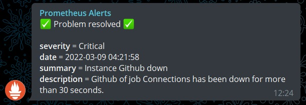

# Prometheus-Telegram

[](https://github.com/hatamiarash7/Prometheus-Telegram/actions/workflows/Publish.yml)

It's a simple API to handle alert requests and send them via Telegram.



## How-to use

1. Create a Telegram bot using [botfather](https://t.me/botfather)
2. Keep `BOT TOKEN` for later
3. Get your `API ID` and `API Hash` from [Telegram Website](https://core.telegram.org/api/obtaining_api_id)
4. Get your `chatid` using @@RawDataBot bot ( Just invite it to any group )
5. Run image with required environment variables

   ```bash
   docker run -d -p 8080:8080 \
       -e TG_BOT_TOKEN='291043804:AAGHDLwaXNN2U2oI0uxCR35KsivsxNUqT3o' \
       -e TG_API_ID='45491' \
       -e TG_API_HASH='12e2adfabe4fb77970b6bae2823taf92' \
       -e TG_CHAT_ID='-200160323059' \
       hatamiarash7/telegram-handler:latest
   ```

6. Use [alertmanager](https://prometheus.io/docs/alerting/latest/alertmanager/) to send alerts using webhook to `http://<IP>:8080/get_alerts` URL

---

## Support 💛

[](https://ko-fi.com/D1D1WGU9)

<div><a href="https://payping.ir/@hatamiarash7"></a></div>

## Contributing 🤝

Don't be shy and reach out to us if you want to contribute 😉

1. Fork it !
2. Create your feature branch : `git checkout -b my-new-feature`
3. Commit your changes : `git commit -am 'Add some feature'`
4. Push to the branch : `git push origin my-new-feature`
5. Submit a pull request

## Issues

Each project may have many problems. Contributing to the better development of this project by reporting them. 👍
